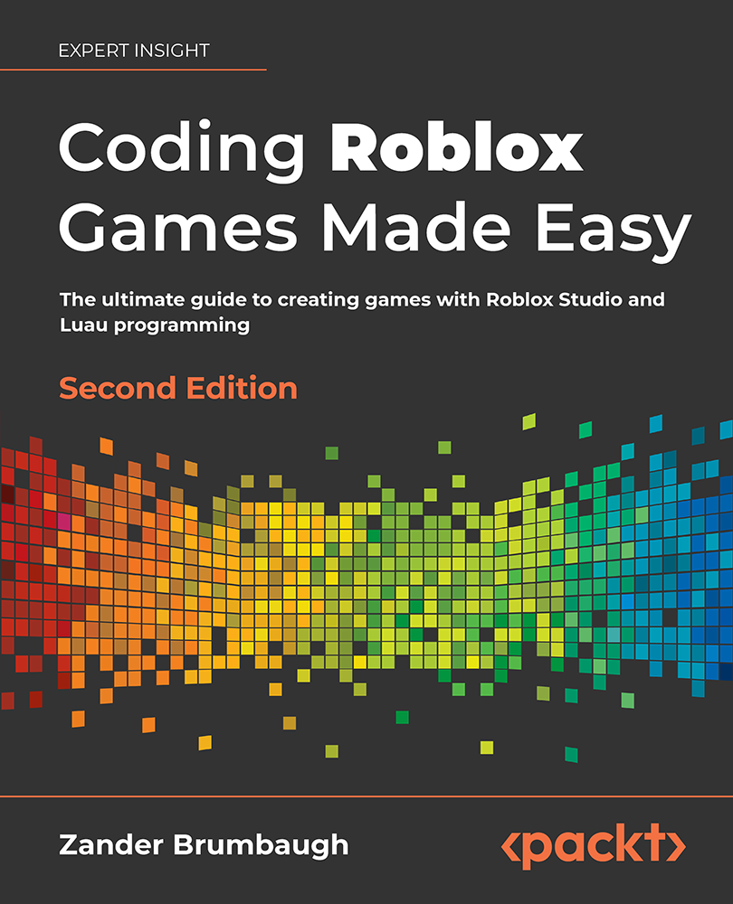

# Coding-Roblox-Games-Made-Easy-2nd-Edition
Coding Roblox Games Made Easy - 2nd Edition, Published by Packt

<a href="https://www.packtpub.com/product/coding-roblox-games-made-easy/9781803234670"></a>

This is the code repository for [Coding-Roblox-Games-Made-Easy-2nd-Edition](https://www.packtpub.com/product/coding-roblox-games-made-easy/9781803234670), published by Packt.

**The ultimate guide to creating games with Roblox Studio and Luau programming**

## What is this book about?
Roblox is a huge entertainment platform like no other for both playing and creating games. With over 200 million monthly active users, Roblox has enabled new and experienced developers to create successful games, often called experiences, that can be played globally at no cost.

Coding Roblox Games Made Easy, 2nd Edition, builds a solid foundation of the concepts you need to embark on the journey of building two end-to-end games in Roblox in increasing order of complexity.

For the first game, you will create obstacles and traps for an obstacle course game (obby) and overcome them to win the game alongside other players and earn rewards. In the next game, you will manage player avatars, their weapons, a battlefield and add programming logic for the players to find their weapons and fight, with a reward for the last player standing.

Finally, you'll delve into the logistics of game production, focusing on optimizing your games' performance by implementing impressive mechanics, monetization, and marketing practices. We will also discuss how the Metaverse is set to change the dynamics of user experience and what the future holds for Roblox game developers.

Let's create and share experiences through play!

This book covers the following exciting features: 
* Understand how to use Roblox Studio and other free resources
* Learn how to code in Luau: basics, game systems, physics manipulation, etc.
* Test, evaluate, and redesign to create bug-free and engaging games
* Use Roblox programming and rewards to make your first game
* Move from a lobby to a battleground, build avatars and create weapons with which to fight
* Master the three Ms: Mechanics, Monetization, Marketing
* Learn 50 cool things to do on Roblox

If you feel this book is for you, get your [copy](https://www.amazon.com/Coding-Roblox-Games-Made-Easy/dp/1803234679) today!

## Instructions and Navigations
All of the code is organized into folders. For example, Chapter03.

The code will look like the following:
```
local myBool = true
myBool = not myBool
print(myBool)
```

**Following is what you need for this book:**
This Roblox book is for anyone who is interested in learning how to develop games on the Roblox platform or those already familiar with Roblox who want to explore the best tips, tricks, and Roblox and Lua practices for efficient development.

With the following software and hardware list you can run all code files present in the book (Chapter 1-8).

### Software and Hardware List

| Chapter  | Software required                   | OS required                        |
| -------- | ------------------------------------| -----------------------------------|
| 1-8      | Roblox Studio                       | Windows, Mac OS X, and Linux (Any) |

We also provide a PDF file that has color images of the screenshots/diagrams used in this book. [Click here to download it](https://static.packt-cdn.com/downloads/9781803234670_ColorImages.pdf).

## Get to Know the Author
**Zander Brumbaugh**
is an independent programmer, project manager, and game designer. The games he has made or contributed to have been played more than 300 million times. He has created popular games including Anime Lifting Simulator, My Salon, Munching Masters, Power Simulator amongst others. Zander currently attends the University of Washington and is part of the Paul G. Allen School of Computer Science and Engineering. At the time of writing, Zander is 19 years old.


## Community & Support
Join the book [Discord Server](https://discord.gg/JEv2mqygZB) to participate in the ongoing discussions or/and initiate a new one. You will find other developers reading the book alongside and helping each other with questions.
### Download a free PDF

 <i>If you have already purchased a print or Kindle version of this book, you can get a DRM-free PDF version at no cost.<br>Simply click on the link to claim your free PDF.</i>
<p align="center"> <a href="https://packt.link/free-ebook/9781803234670">https://packt.link/free-ebook/9781803234670 </a> </p>